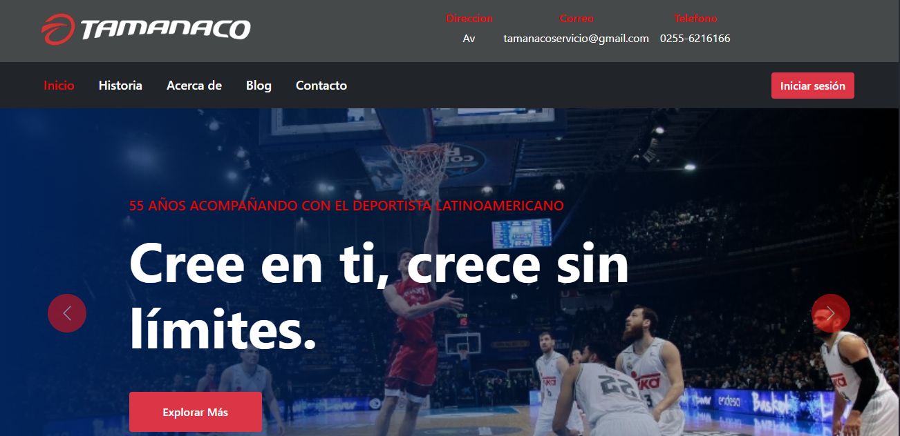
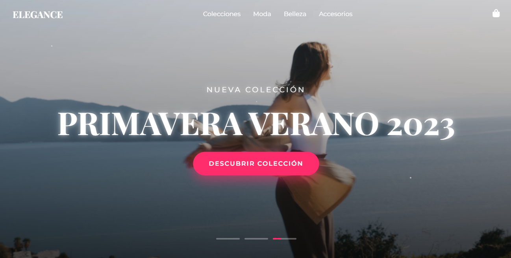

 

<h2>/ about me /</h2>
  
- ⭐ Full Stack Developer
- 💀 Web Development Specialist
- 👾 Passionate about clean code

<h2>/ current skills /</h2>
  
- <h4> languages </h4>
  
  
  
  
  
  
- <h4> frameworks & libraries </h4>
  
  
  
  
- <h4> development tools </h4>
  
  
  

  

<a href="https://github.com/Joanderj">My GitHub Profile</a>

  

## 🚀 Mis Proyectos Destacados

<table>
  <tr>
    <td>
      
      <h3>Tamanaco Sport</h3>
      
Sistema integral de gestión empresarial con módulos completos

      

        
        
        
        
        
        
        
      

    </td>
    <td>
      
      <h3>Moda Elegante</h3>
      
Plataforma e-commerce especializada en moda femenina

      

        
        
        
        
        
      

    </td>
  </tr>
</table>

